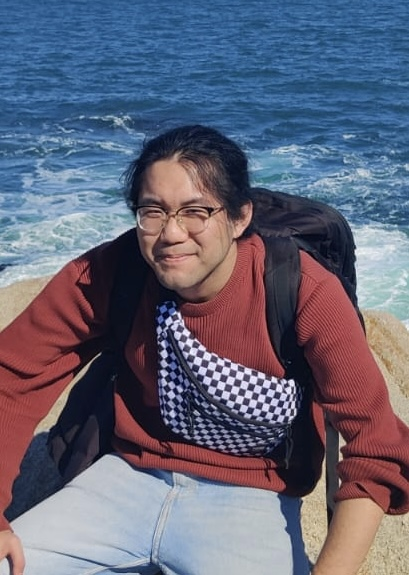

# Jiahui's Personal Website

## About me

Hi! I am Jiahui Xu, a PhD student from Beijing, China. I joined the Digital Systems and Design Automation Group (DYNAMO) at ETH Zurich in 2022. I am supervised by Prof. Lana Josipović. My research aims to improve high-level synthesis design flow using formal methods.

I have a background in telecommunications engineering. I have a laurea in Electronic and Communications engineering from Politecnico di Torino in Italy, and a master’s degree in Communications Engineering from Technical University of Munich in Germany.

[Email](mailto:jxu@ethz.ch), [Google Scholar](https://scholar.google.com/citations?user=SO-HH4gAAAAJ&hl=en&authuser=1), [LinkedIn](https://www.linkedin.com/in/jiahui-xu-787483204/), [Our research group](https://dynamo.ethz.ch/).

## Publications

- **Jiahui Xu** and Lana Josipović. [Automatic Inductive Invariant Generation for Scalable Dataflow Circuit Verification](https://dynamo.ethz.ch/wp-content/uploads/sites/22/2023/10/Xu_ICCAD23_Inductive_Invariants.pdf). In Proceedings of the Intl. Conference on Computer-Aided Design (ICCAD’23)
- **Jiahui Xu** and Lana Josipović. [Automatic Inductive Invariant Generation for Scalable Dataflow Circuit Verification](https://dynamo.ethz.ch/wp-content/uploads/sites/22/2023/10/Xu_IWLS23_Inductive_Invariants.pdf). In Proceedings of the Intl. Workshop on Logic Synthesis (IWLS’23), pages 179–87, Lausanne, Jun 2023.
- **Jiahui Xu**, Emmet Murphy, Jordi Cortadella, and Lana Josipović. [Eliminating Excessive Dynamism of Dataflow Circuits Using Model Checking](https://dynamo.ethz.ch/wp-content/uploads/sites/22/2023/03/Xu_FPGA23_EliminatingExcessiveDynamism.pdf). In Proceedings of the 31st ACM/SIGDA Intl. Symposium on Field Programmable Gate Arrays (FPGA’23), pages 27–37, Monterey, CA, February 2023.

## Education

- **Ph.D. ETH Zurich, Zurich, Switzerland** in the Dept. of Information Technology and Electrical Engineering. 
- **M.Sc. (with high distinction),~Technical University of Munich, Munich, Germany** in Communications Engineering. 
- **B.Sc.,~Politecnico di Torino, Turin, Italy** in Electronic and Communications Engineering. 

## Academic Services

Secondary reviewer in ASAP~('23), DSD~('23), FPT~('22, '23), FPGA~('24).
